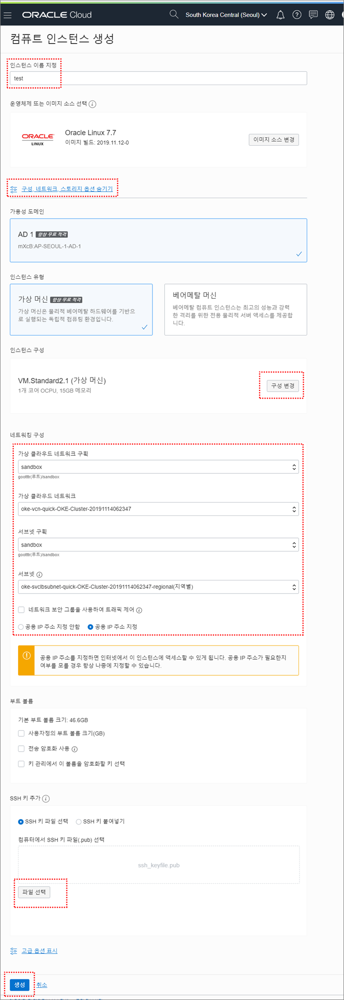
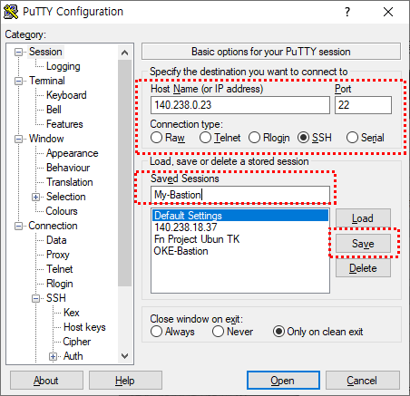
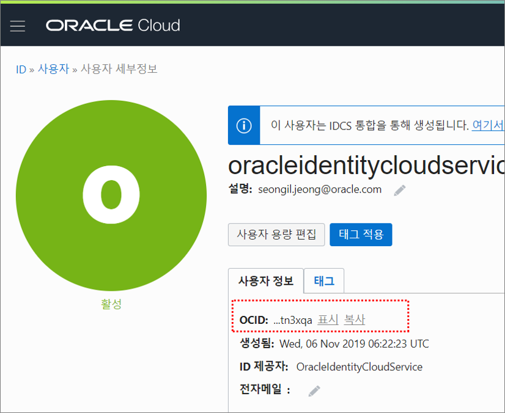
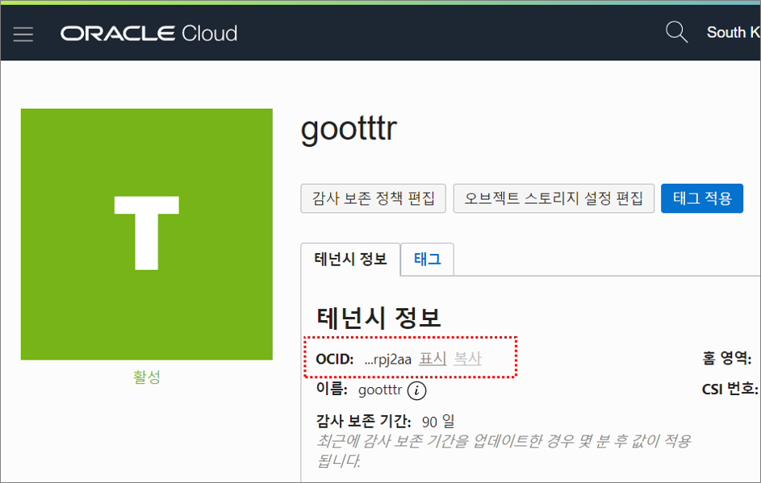

# OKE 클러스터 생성 및 Deployment 환경설정


### 1. Policy 입력

메뉴위치 : 거버넌스 및 관리 > ID > 정책 > **`정책 생성`** 버튼 클릭

- 정책입력 : **``allow service OKE to manage all-resources in tenancy``**

- 루트(Root) 구획에 생성 필수

- 생성 후 적용시점까지 몇 분 소요될 수 있음


### 2. 컨테이너 클러스터(OKE) 생성

메뉴위치 : 솔루션 및 플랫폼 > 개발자 서비스 > 컨테이너 클러스터(OKE) > **`클러스터 생성`** 버튼 클릭

- **빠른 생성** 선택

- 가상 클라우드 네트워크 생성 **전용(Private)** 선택

- 노드 풀 생성 **구성 : VM.Standard2.1 / 노드 수 : 2**

- KUBERNETES 대시보드 사용 : **체크**

- TILLE(HELM) 사용 : **체크**


### 3. Bastion Server 생성

Oracle Kubernetes 에 접속하기 위한 Bastion Server를 생성합니다.

메뉴위치 : 코어 인프라 > 컴퓨트 > 인스턴스 > **`인스턴스 생성`** 버튼 클릭



* 인스턴스 이름 지정

* 운영체제 또는 이미지 소스 선택 : Oracle Linux 7.7 (default)

* ``구성, 네트워크, 스토리지 옵션 숨기기`` 클릭

* 가용성 도메인 : AD1 (default)

* 인스턴스 유형 : 가상 머신 (default)

* 인스턴스 구성 : ``구성 변경`` 클릭 후 VM.Standard2.1 선택

* 가상 클라우드 네트워크 구획 : 본인 구획 선택

* 가상 클라우드 네트워크 : oke-xxx 선택 (OKE생성시 자동으로 만들어진 VNC)

* 서브넷 구획 : 본인 구획 선택

* 서브넷 : oke-xxx (공용서브넷 선택)

* ``공용 IP 주소 지정`` 선택 (= Public IP 생성)

* SSH 키 추가 : 파일 선택 후 SSH Public Key 선택

  (※ 참고 SSH Key 생성방법)

* ``생성`` 버튼 클릭


### 4. Bastion Server 접속 및 Oracle Cloud CLI 설치

생성한 Bastion Server 에 Oracle Cloud CLI 를 설치합니다.

메뉴위치 : 코어 인프라 > 컴퓨트 > 인스턴스 > 이전에 생성한 컴퓨트 인스턴스 클릭


- 생성한 Bastion Server 의 공용(Public) IP 주소 확인

#### 4.1 PuTTY 를 이용한 접속



- Host Name : Public IP
- Connection type : SSH
- Saved Sessions : 세션 저장 이름 (임의로 입력)


- 왼쪽메뉴 ``Connection > SSH > Auth` 클릭
- Private key file for authentication : 생성한 SSH 키의 Private 키 선택

세션 저장 후 접속 테스트


#### 4.2 OCI-CLI 설치

참고 URL : https://docs.cloud.oracle.com/iaas/Content/API/SDKDocs/cliinstall.htm

```
[opc@test ~]$ bash -c "$(curl -L https://raw.githubusercontent.com/oracle/oci-cli/master/scripts/install/install.sh)"
...
...
===> In what directory would you like to place the install? (leave blank to use '/home/opc/lib/oracle-cli'):   <-- 엔터
...
===> In what directory would you like to place the 'oci' executable? (leave blank to use '/home/opc/bin'):   <-- 엔터
...
===> In what directory would you like to place the OCI scripts? (leave blank to use '/home/opc/bin/oci-cli-scripts'):   <-- 엔터
...
===> Currently supported optional packages are: ['db (will install cx_Oracle)']
What optional CLI packages would you like to be installed (comma separated names; press enter if you don't need any optional packages)?:   <-- 엔터
...
===> Modify profile to update your $PATH and enable shell/tab completion now? (Y/n): y
===> Enter a path to an rc file to update (leave blank to use '/home/opc/.bashrc'):   <-- 엔터
...
...

[opc@test ~]$ oci -v
2.6.14
```


#### 4.3 OCI-CLI config 생성

```
[opc@test ~]$ oci setup config
...
Enter a location for your config [/home/opc/.oci/config]:   <-- 엔터
Enter a user OCID:  <-- 클라우드 콘솔에서 user OCID 복사 (아래 이미지 참고)
Enter a tenancy OCID:   <-- 클라우드 콘솔에서 tenancy OCID 복사 (아래 이미지 참고)
Enter a region (e.g. ap-mumbai-1, ap-seoul-1, ap-sydney-1, ap-tokyo-1, ca-toronto-1, eu-frankfurt-1, eu-zurich-1, sa-saopaulo-1, uk-gov-london-1, uk-london-1, us-ashburn-1, us-gov-ashburn-1, us-gov-chicago-1, us-gov-phoenix-1, us-langley-1, us-luke-1, us-phoenix-1): ap-seoul-1
Do you want to generate a new RSA key pair? (If you decline you will be asked to supply the path to an existing key.) [Y/n]: y
Enter a directory for your keys to be created [/home/opc/.oci]:
Enter a name for your key [oci_api_key]:
Public key written to: /home/opc/.oci/oci_api_key_public.pem
Enter a passphrase for your private key (empty for no passphrase):
Private key written to: /home/opc/.oci/oci_api_key.pem
Fingerprint: e5:ef:17:98:6e:b3:e1:64:01:cc:46:85:7b:58:93:0b
Config written to /home/opc/.oci/config
...
...

[opc@test ~]$ ls .oci
config  oci_api_key.pem  oci_api_key_public.pem
```

- user OCID 확인방법

  프로파일 > 사용자명 클릭

  

  사용자 세부정보 > OCID 복사 클릭

  

- tenancy OCID 확인방법

  프로파일 > 테넌시: xxx 클릭

  

  테넌시 정보 > OCID 복사 클릭

  


#### 4.4 API 키 추가

메뉴위치 : 거버넌스 및 관리 > ID > 사용자 > **`사용자 ID`** 클릭

API 키 아래에 있는 ``공용 키 추가`` 버튼 클릭


앞에서 생성한 ``oci_api_key_public.pem`` 파일을 열어서 내용 복사해서 붙여넣기


### 5. Kubectl 설치

생성한 Bastion Server 에 Kubectl 을 설치합니다.

참고 : https://kubernetes.io/docs/tasks/tools/install-kubectl/#install-kubectl-on-linux

```
[opc@test ~]$ sudo su
[root@test opc]# cat <<EOF > /etc/yum.repos.d/kubernetes.repo
> [kubernetes]
> name=Kubernetes
> baseurl=https://packages.cloud.google.com/yum/repos/kubernetes-el7-x86_64
> enabled=1
> gpgcheck=1
> repo_gpgcheck=1
> gpgkey=https://packages.cloud.google.com/yum/doc/yum-key.gpg https://packages.cloud.google.com/yum/doc/rpm-package-key.gpg
> EOF
[root@test opc]# yum install -y kubectl
...
...

[opc@test ~]$ kubectl version
Client Version: version.Info{Major:"1", Minor:"12", GitVersion:"v1.12.7+1.2.3.el7", GitCommit:"cfc2012a27408ac61c8883084204d10b31fe020c", GitTreeState:"archive", BuildDate:"2019-05-23T20:00:05Z", GoVersion:"go1.10.8", Compiler:"gc", Platform:"linux/amd64"}
```

