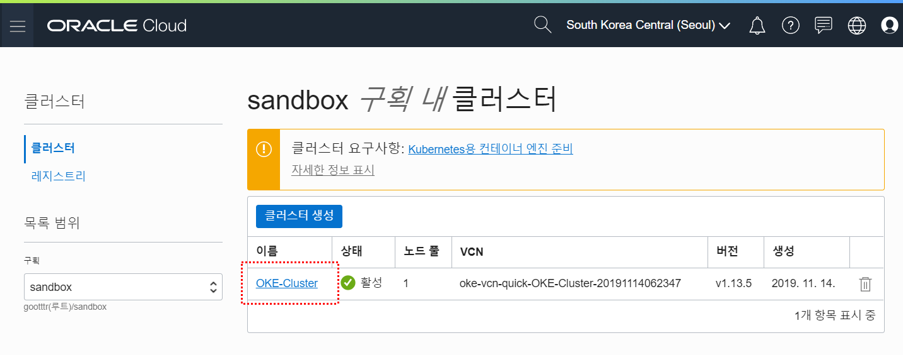
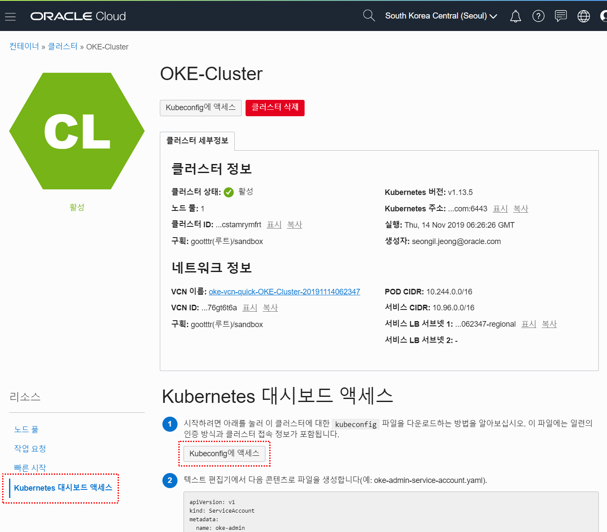
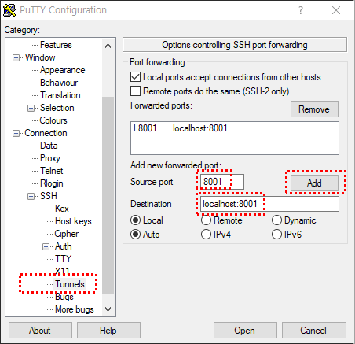
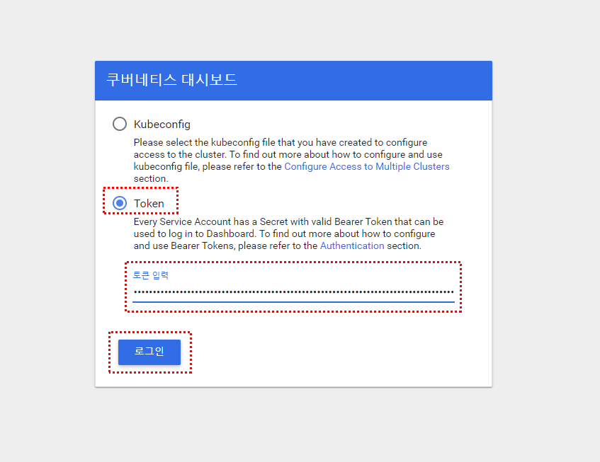
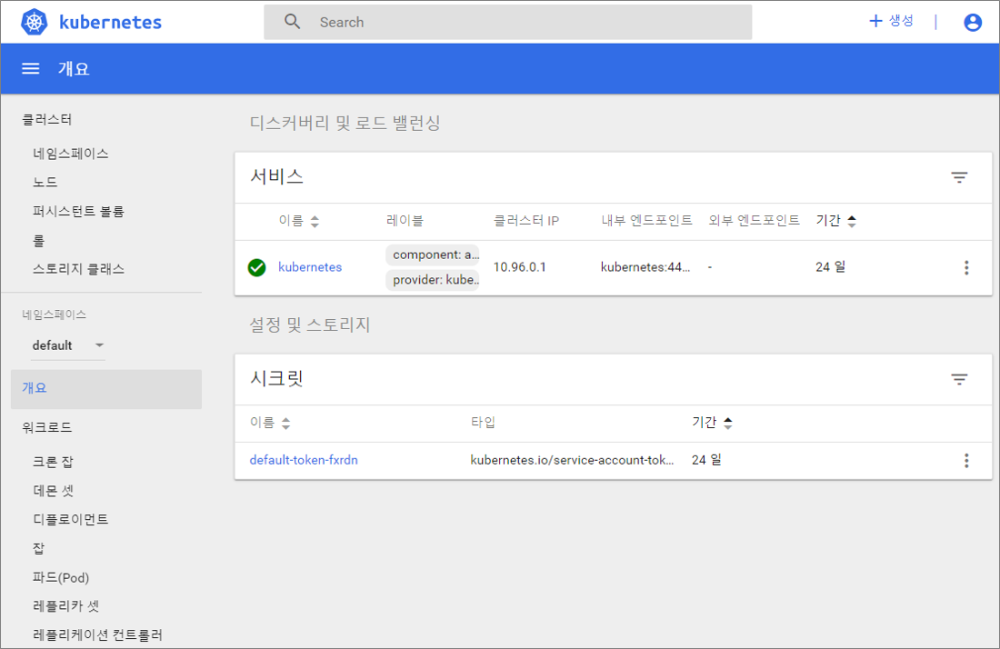

# Kubernetes 대시보드 실행 및 접속


### 1. Kubeconfig 파일 생성

메뉴위치 : 솔루션 및 플랫폼 > 개발자 서비스 > 컨테이너 클러스터(OKE) > 생성한 클러스터 이름 클릭



좌측 하단의 ``Kubernetes 대시보드 액세스`` 메뉴 클릭

``Kubeconfig에 액세스`` 버튼 클릭



팝업창의 ``Kubeconfig에 액세스하는 방법`` 수행

```
[opc@test ~]$ mkdir -p $HOME/.kube
[opc@test ~]$ oci ce cluster create-kubeconfig --cluster-id ocid1.cluster.oc1.ap-seoul-1.aaaaaaaaaftdqmjvgu2dcnjzgjswgmtdmiydgyjxmvrgkyrzgcstamrymfrt --file $HOME/.kube/config --region ap-seoul-1 --token-version 2.0.0
New config written to the Kubeconfig file /home/opc/.kube/config
[opc@test ~]$ ls .kube
config
```


### 2. oke-admin 관리자 서비스 계정 생성

동일한 메뉴 ``Kubernetes 대시보드 액세스``에서 ②번 ③번 항목 수행


### 3. SSH Tunneling

Bastion Server 에서는 웹브라우저 실행을 할 수 없으므로 PuTTY를 이용한 SSH Tunneling 사용

앞에서 PuTTY에 저장한 세션정보 ``Load`` 클릭

왼쪽 메뉴트리에서 ``Connection > SSH > Tunnels`` 메뉴 클릭



- Source port : 8001

- Destination : localhost:8001

- ``Add`` 버튼 클릭

- 해당 세션 ``Save`` 후 ``Open`` 클릭

  

### 4. 인증토큰 생성

동일한 메뉴 ``Kubernetes 대시보드 액세스``에서 ④번 항목 수행

````
[opc@test ~]$ kubectl -n kube-system describe secret $(kubectl -n kube-system get secret | grep oke-admin | awk '{print $1}')
````

Kubernetes 대시보드 접속시 사용할 수 있도록 ``token:      `` 값 복사해놓음


### 5. Kubernetes 대시보드 실행 및 접속

Bastion Server에서 Kubernetes 대시보드 실행

````
[opc@test ~]$ kubectl proxy
Starting to serve on 127.0.0.1:8001
````

각자 Local PC에서 웹브라우저 실행 후 Kubernetes 대시보드 접속

````
http://localhost:8001/api/v1/namespaces/kube-system/services/https:kubernetes-dashboard:/proxy/#!/login
````



- Token 선택
- 4번에서 생성한 인증토큰 붙여넣기
- ``로그인`` 버튼 클릭



Kubernetes 대시보드 접속 완료