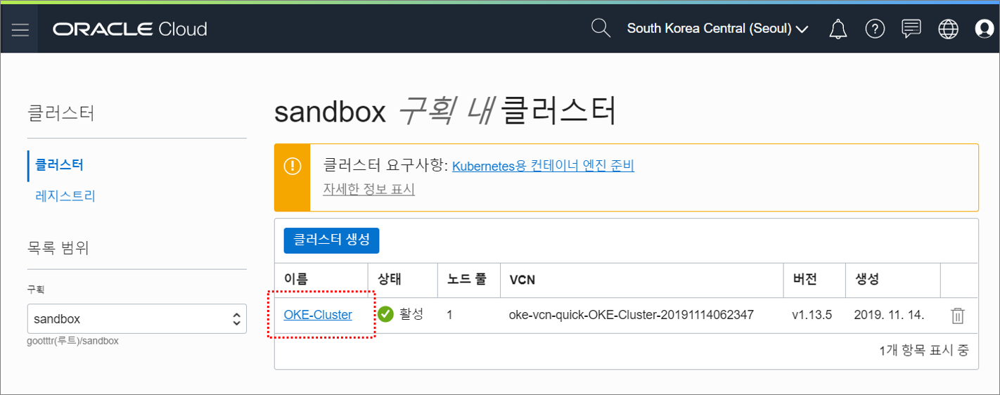
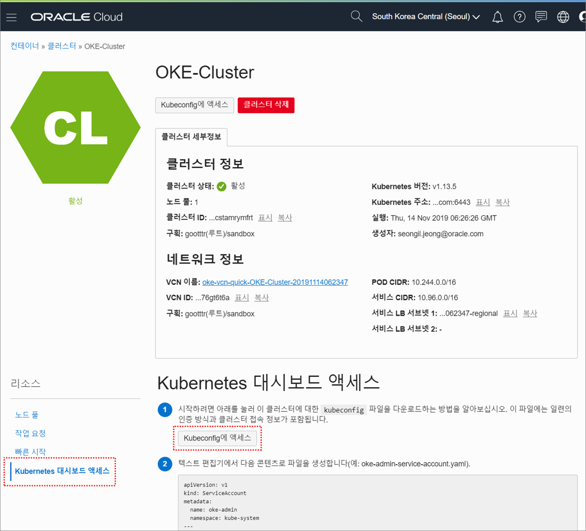

# Kubernetes 대시보드 실행 및 접속


### 1. Kubeconfig 파일 생성

메뉴위치 : 솔루션 및 플랫폼 > 개발자 서비스 > 컨테이너 클러스터(OKE) > 생성한 클러스터 이름 클릭



좌측 하단의 ``Kubernetes 대시보드 액세스`` 메뉴 클릭

``Kubeconfig에 액세스`` 버튼 클릭



``Kubeconfig에 액세스하는 방법`` 수행

```
[opc@test ~]$ mkdir -p $HOME/.kube
[opc@test ~]$ oci ce cluster create-kubeconfig --cluster-id ocid1.cluster.oc1.ap-seoul-1.aaaaaaaaaftdqmjvgu2dcnjzgjswgmtdmiydgyjxmvrgkyrzgcstamrymfrt --file $HOME/.kube/config --region ap-seoul-1 --token-version 2.0.0
New config written to the Kubeconfig file /home/opc/.kube/config
[opc@test ~]$ ls .kube
config
```

