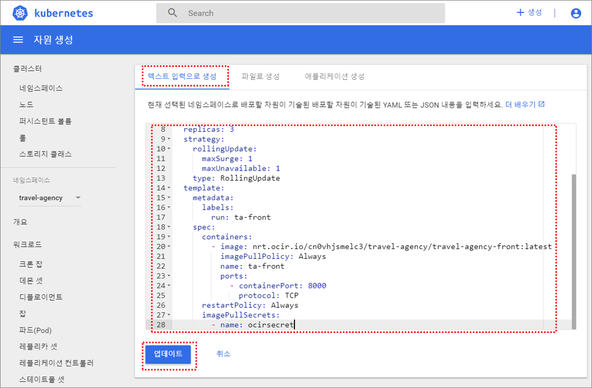
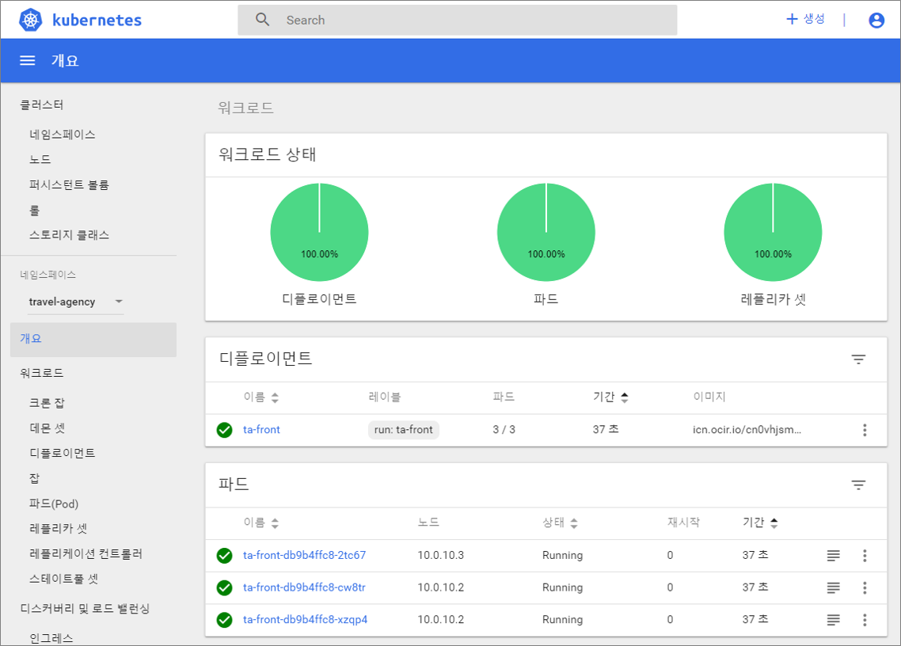

### 1. Kubernetes 대시보드 접속

이전 실습을 참고해서 Kubernetes 대시보드에 접속


### 2. Namespace 및 Secret 생성

Hands-on 과정에서 진행하게될 MSA 기반의 Web Application 을 배포할 namespace 및 Secret을 생성합니다.

> Kubernetes 에서 namespace 는 논리적인 구획입니다.

Bastion Server 접속 후 다음 명령어 실행

````
[opc@test ~]$ kubectl create namespace travel-agency
namespace/travel-agency created
[opc@test ~]$ kubectl get namespace -A
NAME             STATUS   AGE
default          Active   24d
kube-public      Active   24d
kube-system      Active   24d
travel-agency    Active   21d
````

다음은 Secret 생성입니다.

> secret은 보안이 중요한 패스워드나, API 키, 인증서 파일들은 secret에 저장할 수 있습니다. secret은 항상 메모리에 저장되어 있기 때문에 상대적으로 접근이 어렵습니다. 하나의 secret의 사이즈는 최대 1M까지 지원되는데, 메모리에 지원되는 특성 때문에, secret을 여러개 저장하게 되면 API Server나 노드에서 이를 저장하는 kubelet의 메모리 사용량이 늘어나서 Out Of Memory와 같은 이슈를 유발할 수 있기 때문에, 보안적으로 꼭 필요한 정보만 secret에 저장하도록 하는게 좋습니다.

````
kubectl create secret docker-registry ocirsecret --docker-server=<region-code>.ocir.io --docker-username='<tenancy-namespace>/<oci-username>' --docker-password='<oci-auth-token>' --docker-email='<email-address>' -n namespace

생성 예)
[opc@test ~]$ kubectl create secret docker-registry ocirsecret --docker-server=icn.ocir.io --docker-username='cnql8p76c3sq/seongil.jeong@oracle.com' --docker-password='33LreAVXY91I<s+{+vP<' --docker-email='seongil.jeong@oracle.com' -n travel-agency

[opc@test ~]$ kubectl get secret -A
````


### 3. Pod 생성

샘플 웹애플리케이션 travel-agency 메인페이지 Pod 생성

Kubernetes 대시보드를 사용한 생성

- [kubernetes-deployment.yaml 파일 다운로드](resources/kubernetes-deployment.yaml)


- Kubernetes 대시보드 > 네임스페이스 : travel-agency 선택

- Kubernetes 대시보드 > 디플로이먼트 > ``생성`` 버튼 클릭



- ``텍스트 입력으로 생성`` 탭에서 kubernetes-deployment.yaml 내용 붙여넣기
- ``업데이트`` 버튼 클릭



- 디플로이먼트, 파드 상태 정상 확인


### 4. Service 생성

샘플 웹애플리케이션 travel-agency 메인페이지 접근을 위한 Service 생성

Kubectl 을 사용한 생성

- [kubernetes-svc.yaml 파일 다운로드](resources/kubernetes-svc.yaml)

PuTTY를 통한 Bastion Server 접속 후 ``kubernetes-svc.yaml`` 파일 생성

````
[opc@test ~]$ vi kubernetes-svc.yaml
[opc@test ~]$ kubectl create -f kubernetes-svc.yaml -n travel-agency
service/ta-front created
[opc@test ~]$ kubectl get service -n travel-agency
NAME       TYPE           CLUSTER-IP     EXTERNAL-IP     PORT(S)          AGE
ta-front   LoadBalancer   10.96.226.22   140.238.20.78   9004:30802/TCP   47s
````

오라클 클라우드 콘솔``(코어 인프라 > 네트워킹 > 로드 밸런서)``에서 생성한 로드 밸런서 확인가능


### 5. 샘플 웹 애플리케이션 접속

Local PC에서 웹브라우저 실행 후 해당 서비스 IP:Port 로 접속

````
ex) 140.238.20.78:9004?root=dashboard
````

정상접속 확인


